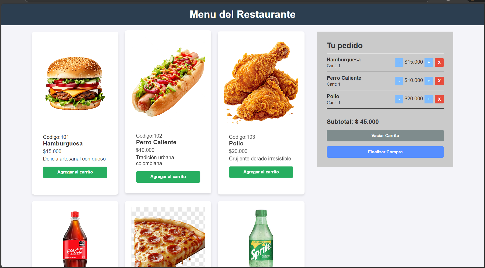

# Carrito de Compras - Restaurante

## Descripción corta del proyecto
Es una aplicación web interactiva que simula el menú y el carrito de compras de un restaurante de comidas rápidas. Permite a los usuarios visualizar productos, agregarlos al pedido, modificar cantidades y mantener el registro de su cuenta de forma dinámica. El proyecto destaca por tener separación de lógica de negocio, persistencia de datos y una robusta cobertura de pruebas unitarias.

## Requisitos previos
* **Para visualizar la página:** Ninguno. Solo necesitas un navegador web moderno (Chrome, Firefox, Edge, etc).
* **Para ejecutar las pruebas unitarias:** Necesitas tener [Node.js](https://nodejs.org/) instalado en tu computadora para poder usar los comandos de `npm` con jest.

## Cómo ejecutar el proyecto localmente

**1. Para ver la aplicación:**
* **Opción A (Recomendada):** Abre el proyecto en Visual Studio Code, haz clic derecho sobre el archivo `index.html` y selecciona **"Open with Live Server"** (requiere tener la extensión Live Server instalada).

**2. Para ejecutar las pruebas unitarias:**
Abre tu terminal en la carpeta del proyecto y ejecuta los siguientes comandos:
\`\`\`bash
npm install   # Instala las dependencias de Jest (solo la primera vez)
npm test      # Ejecuta la batería de pruebas y muestra el reporte de cobertura
\`\`\`

## Estructura del proyecto
La arquitectura del proyecto está pensada para ser modular y escalable:

* `index.html`: Estructura base de la aplicación.
* `mi-carrito-app/css/style.css`: Hojas de estilo empleando CSS Grid y Flexbox para diseño Responsive.
* `mi-carrito-app/js/app.js`: Archivo principal que contiene la base de datos simulada, la lógica del negocio, la manipulación del DOM y el controlador de eventos.
* `mi-carrito-app/js/app.test.js`: Archivo de pruebas unitarias implementadas con el framework Jest.
* `mi-carrito-app/assets/img/`: Carpeta con las fotografías de los productos.

## Funcionalidades implementadas
- [x] Visualización en cuadrícula (Grid) del menú de productos.
- [x] Agregar productos al carrito de compras.
- [x] Detectar si un producto ya existe en el carrito y aumentar su cantidad en lugar de duplicarlo.
- [x] Aumentar y disminuir la cantidad de cada ítem desde el panel lateral.
- [x] Eliminar productos individuales del carrito.
- [x] Cálculo automático y en tiempo real del subtotal de la compra.
- [x] Botón para vaciar completamente el carrito.
- [x] Alertas informativas al finalizar la compra.
- [x] **Persistencia de datos:** El carrito sobrevive si el usuario recarga la página (usando `localStorage`).
- [x] **Diseño Responsive:** La interfaz se adapta automáticamente a pantallas de celulares y tablets.
- [x] **Calidad de Código:** Pruebas unitarias de la lógica principal usando Jest con una cobertura (Coverage) superior al 80%.

## Capturas de pantalla
